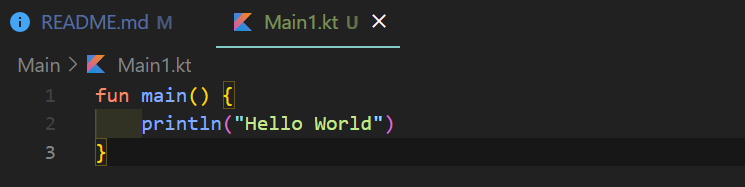
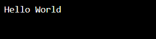
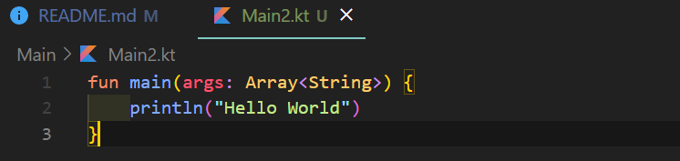
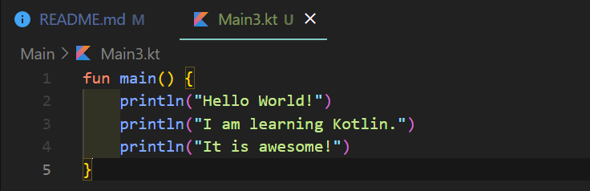
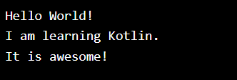
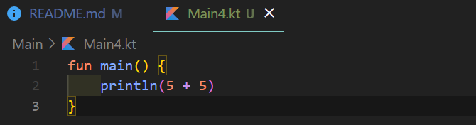
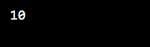
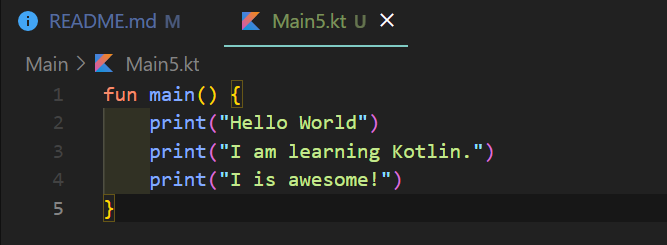
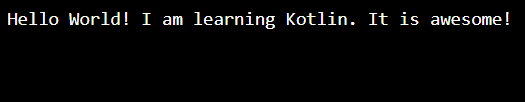

# Kotlin
Programming_Exercise

參考網站學習 w3schools (https://w3schools.com/kotlin/index.php)
# Kotlin Tutorial

## Learn Kotlin

Kotlin 是一種現代、流行的編程語言。

Kotlin 易於學習，特別是如果您已經了解 Java（它與 Java 100% 兼容）。

Kotlin 用於開發 Android 應用程序、服務器端應用程序等等。

# Kotlin Introduction

## What is Kotlin?

Kotlin 是 JetBrains 於 2016 年發布的一種現代、流行的編程語言。

它變得非常流行，因為它與Java（目前最流行的編程語言之一）兼容，這意味著 Java 代碼（和庫）可以在 Kotlin 程序中使用。

Kotlin 用於：

- 移動應用程序（特別是 Android 應用程序）
- Web開發
- 服務器端應用程序
- 數據科學
- 還有更多！

## Why Use Kotlin?

- Kotlin 與 Java 完全兼容
- Kotlin 適用於不同的平台（Windows、Mac、Linux、Raspberry Pi 等）
- Kotlin 簡潔安全
- Kotlin 很容易學習，特別是如果您已經了解 Java
- Kotlin 可以免費使用
- 大社區/支持

# Kotlin Syntax

## Kotlin Syntax

在上一章中，我們創建了一個名為 的 Kotlin 文件 Main.kt，並使用以下代碼將 "Hello World" 打印到屏幕上：

### 示例說明

fun 關鍵字用於聲明函數。函數是設計用於執行特定任務的代碼塊。在上面的示例中，它聲明了 main() 函數。

該 main() 函數是您將在每個 Kotlin 程序中看到的東西。該函數用於執行代碼。main() 函數大括號內的任何代碼 {} 都將被執行。

比如 println() 函數在函數內部 main()，意思就是會被執行。該 println() 函數用於輸出/打印文本，在我們的示例中它將輸出 "Hello World"。

小知識：在 Kotlin 中，代碼語句不必以分號 ( ; ) 結尾（其他編程語言通常需要分號，例如 Java、C++、C# 00000等）。

## Main Parameters

在 Kotlin 1.3 版本之前，需要使用 main() 帶參數的函數，例如：fun main(args : Array<String>). 上面的例子必須寫成這樣才能工作：

注意：這不再是必需的，沒有它程序也能正常運行。但是，如果您過去一直在使用它，它不會造成任何傷害，並且會繼續使用它。

# Kotlin Output (Print Text)

## Kotlin Output (Print)

該 println() 函數用於輸出值/打印文本：

您可以根據 println() 需要添加任意數量的功能。請注意，它將為每個函數添加一個新行：

您還可以打印數字並執行數學計算：

## The print() function

還有一個 print() 功能，類似於 println()。唯一的區別是它不會在輸出的末尾插入新行：

