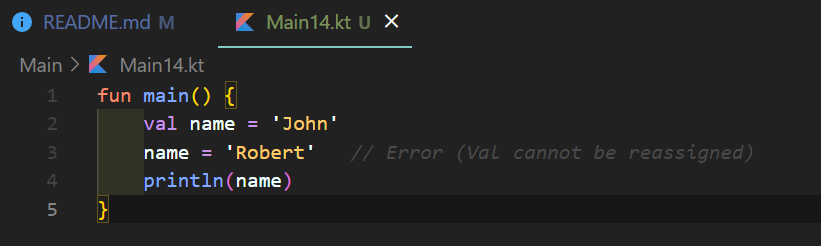

# Kotlin
Programming_Exercise

參考網站學習 w3schools (https://w3schools.com/kotlin/index.php)
# Kotlin Tutorial

## Learn Kotlin

Kotlin 是一種現代、流行的編程語言。

Kotlin 易於學習，特別是如果您已經了解 Java（它與 Java 100% 兼容）。

Kotlin 用於開發 Android 應用程序、服務器端應用程序等等。

# Kotlin Introduction

## What is Kotlin?

Kotlin 是 JetBrains 於 2016 年發布的一種現代、流行的編程語言。

它變得非常流行，因為它與Java（目前最流行的編程語言之一）兼容，這意味著 Java 代碼（和庫）可以在 Kotlin 程序中使用。

Kotlin 用於：

- 移動應用程序（特別是 Android 應用程序）
- Web開發
- 服務器端應用程序
- 數據科學
- 還有更多！

## Why Use Kotlin?

- Kotlin 與 Java 完全兼容
- Kotlin 適用於不同的平台（Windows、Mac、Linux、Raspberry Pi 等）
- Kotlin 簡潔安全
- Kotlin 很容易學習，特別是如果您已經了解 Java
- Kotlin 可以免費使用
- 大社區/支持

# Kotlin Syntax

## Kotlin Syntax

在上一章中，我們創建了一個名為 的 Kotlin 文件 Main.kt，並使用以下代碼將 "Hello World" 打印到屏幕上：

### 示例說明

fun 關鍵字用於聲明函數。函數是設計用於執行特定任務的代碼塊。在上面的示例中，它聲明了 main() 函數。

該 main() 函數是您將在每個 Kotlin 程序中看到的東西。該函數用於執行代碼。main() 函數大括號內的任何代碼 {} 都將被執行。

比如 println() 函數在函數內部 main()，意思就是會被執行。該 println() 函數用於輸出/打印文本，在我們的示例中它將輸出 "Hello World"。

小知識：在 Kotlin 中，代碼語句不必以分號 ( ; ) 結尾（其他編程語言通常需要分號，例如 Java、C++、C# 00000等）。

## Main Parameters

在 Kotlin 1.3 版本之前，需要使用 main() 帶參數的函數，例如：fun main(args : Array<String>). 上面的例子必須寫成這樣才能工作：

注意：這不再是必需的，沒有它程序也能正常運行。但是，如果您過去一直在使用它，它不會造成任何傷害，並且會繼續使用它。

# Kotlin Output (Print Text)

## Kotlin Output (Print)

該 println() 函數用於輸出值/打印文本：

您可以根據 println() 需要添加任意數量的功能。請注意，它將為每個函數添加一個新行：

您還可以打印數字並執行數學計算：

## The print() function

還有一個 print() 功能，類似於 println()。唯一的區別是它不會在輸出的末尾插入新行：

# Kotlin Comments

## Kotlin Comments

註釋可用於解釋 Kotlin 代碼，並使其更具可讀性。它還可用於在測試替代代碼時阻止執行。

## Single-line Comments

單行註釋以兩個正斜杠 (//) 開頭。

Kotlin 忽略行尾之間的任何文本 //（不會執行）。

此示例在一行代碼之前使用單行註釋：

此示例在代碼行末尾使用單行註釋：

## Multi-line Comments

多行註釋以。開頭 /* 和結尾 */。

Kotlin 將忽略 /* 和之間的任何文本。*/

此示例使用多行註釋（註釋塊）來解釋代碼：

# Kotlin Variables

## Kotlin Variables

變量是存儲數據值的容器。

要創建變量，請使用 var or val，並使用等號 (=) 為其賦值：

### 語法

var variableName = value
val variableName = value

The difference between var and val is that variables declared with the var keyword can be changed/modified, while val variables cannot.

## Variable Type

與許多其他編程語言不同，Kotlin 中的變量不需要以指定的 <i>類型聲明</i>（如 "String"代表text 或 “Int”代表number，如果你熟悉的話）。

要在 Kotlin 中創建一個應該存儲文本的變量和另一個應該存儲數字的變量，請查看以下示例：

Kotlin 足夠聰明，可以理解 “John” 是一個String（文本），而 1975 是一個Int（數字）變量。

但是，如果您堅持，可以指定類型：

你也可以聲明一個變量而不賦值，然後再賦值。但是，這只有在您指定類型時才有可能：

這工作正常： 

這將產生一個錯誤：

## Notes on val

val當您使用關鍵字創建變量時，無法更改/重新分配值。

以下示例將生成錯誤：

使用時var，您可以隨時更改值：

## So When To Use val?

當您希望變量始終存儲相同的值時，該 val 關鍵字很有用，例如 PI (3.14159...)：

## Display Variables

就像您在上面的示例中看到的那樣，該 println() 方法通常用於顯示變量。

要組合文本和變量，請使用以下 + 字符：

您還可以使用該 + 字符將變量添加到另一個變量：

對於數值，該 + 字符用作數學運算符：

從上面的示例中，您可以預期：

- x 存儲值 5
- y 存儲值 6
- 然後我們用 println() 方法來顯示 x + y 的值，也就是 11

## Variable Names

變量可以有一個短名稱（如 x 和 y）或更具描述性的名稱（age、sum、totalVolume）。

Kotlin 變量的一般規則是：

- 名稱可以包含字母、數字、下劃線和美元符號
- 名稱應以字母開頭
- 名稱也可以以 $ 和 _ 開頭（但我們不會在本教程中使用它）
- 名稱區分大小寫（“myVar” 和 “myvar” 是不同的變量）
- 名稱應以小寫字母開頭，並且不能包含空格
- 保留字（如 Kotlin 關鍵字，如 varor String）不能用作名稱
